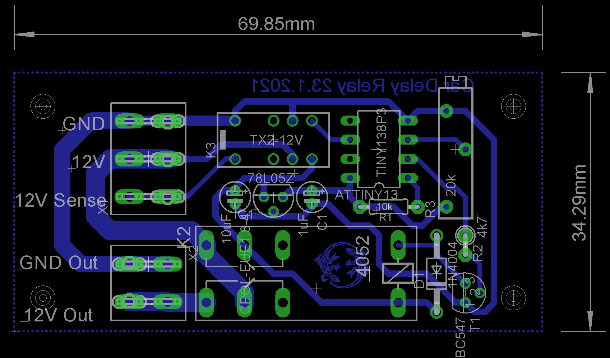

Car Turn Off Delay Relay Board
==============================

IDK how many times chargers for mobiles and other devices that were connected to out classic cars lighter plugs have drained 
the cars batteries to a point where is was impossible to start the car again (usual after the car had not been used for a few weeks).

This board overcomes this problem by disconnecting the power supply to the lighter plug (or anything else) after a defineable period 
(up to approx. 135minutes) after the cars iginition has been turned off. Like this it is still possible to charges mobiles and the like
for a while after the car had been stopped, but not to a point where the cars battery is drained to much.

Once the board turns off the power on its output it also disconnects itself completely from the power supply and wont consume even the 
slightest bit off power in this state.

Design
------

The board was designed with the Eagle PCB editor. So if you want to make changes you'll need this software.

The boart uses a ATTiny microcontroller as its brain. This allows for easy modification of the boards behaviour. The firmware for the 
microcontroller has been written very quick and dirty with Bascom. Bascom might not be a nice solution, but for simple stuff like this
it is good enough. The hex and bin files for upload to the microcontroller are contained in the firmware folder, so you will not need 
Bascom and you can just use whatever tool you prefer to upload the firmware.

The parts on the board are all simple, stanard components which should be readily available at almost every electronic parts store.
The connectores are FASTON Automotive Connectors.

Installing the board
--------------------

* Connect the GND and 12V connectors to the battery of your car. They must have a uninterupted line to the battery, so no switch or the
  like on the way to the battery.
* Connect 12V Sense to the ignition switch of your car or any other line which will have 12V as long as the car is running and which will
  turn of when the engine is stopped.
* Connect 12V Out and GND Out to the lighter plug or any other appliance you want to turn off with a delay.

Configuring the time out/delay
------------------------------

To set the desired turn off delay,do the following:

* Turn the trimmer on the board to a value which is well above the desired target time. Max. time is when the timer is fully at the 5V end.
* Start the timer with a 12V pulse on the sense input and disconnect the sense input immediately.
* Let the time you want the timer to run elapse, e.g. use a time on your phone.
* Once the desired time has elapsed turn the trimer back towards the GND end till the timer stops/relay turns off.

Bingo! You have set the desired turn off delay time.

